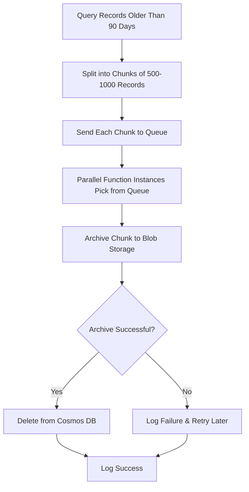

# Azure Cosmos DB Cost Optimization – Tiered Storage Architecture

## 📌 Problem Statement
Our **serverless architecture** in Azure stores billing records in **Azure Cosmos DB**.  
The system is **read-heavy**, but records older than **3 months** are rarely accessed.  
Over time, the database size has grown significantly, increasing costs.

### **Current Constraints**
- **Record Size:** Up to 300 KB
- **Total Records:** ~2M
- **Access Latency:** Old record retrieval within seconds
- **Requirements:**
  - ✅ **Simplicity & Ease of Implementation**
  - ✅ **No Data Loss / No Downtime**
  - ✅ **No Changes to API Contracts**

---

## 🎯 Proposed Solution – **Tiered Storage with Azure Cosmos DB and Azure Blob Storage**

---

### 1. Azure Cosmos DB Storage Fundamentals
- **Single Storage Tier**: Cosmos DB stores all data in high-performance SSD storage.
- **Cost Structure**:
  - **Provisioned Throughput**: Pay for reserved RU/s (Request Units).
  - **Serverless Mode**: Pay per RU consumption.
  - **Storage Cost**: Fixed **$0.25/GB/month** (regardless of access frequency).
- **No Native Archival**: Cosmos DB does not provide a built-in cold storage tier.

---

### 2. Custom Tiered Storage Solution
We implement hot/cold tiers by integrating multiple Azure services:

| Tier         | Service                     | Data Characteristics        | Cost                          |
|--------------|-----------------------------|------------------------------|-------------------------------|
| **Hot Tier** | Azure Cosmos DB              | Recent data (≤ 3 months)     | $0.25/GB/month + RU costs     |
| **Cold Tier**| Azure Blob Storage – Cool    | Archived data (> 3 months)   | ~$0.01/GB/month               |

---

### 3. Implementation

#### Step 1: Enable Azure Blob Storage Cool Tier
- Create a new storage account with Blob service.
- Configure **Cool Tier** for archived records.
- Optional: Set lifecycle management rules for cost optimization.

#### Step 2: Configure Cosmos DB Time-to-Live (TTL)
```javascript
// Example TTL setup using Cosmos DB SDK
container.replace({
    id: "BillingRecords",
    defaultTtl: -1, // Enables TTL globally
    partitionKey: { paths: ["/partitionKey"], kind: "Hash" },
    indexingPolicy: { automatic: true, indexingMode: "consistent" }
});

// You can later set a custom TTL at the document level if required
```

#### Step 3: Implement Archival Trigger
- Use a **Daily Timer Trigger** or **Cosmos DB Change Feed** in Azure Functions.
- Identify records older than 90 days.
- Archive them to Blob Storage and delete from Cosmos DB after successful archival.

---

## 🏗 Architecture Diagram – Flow Explanation

```mermaid
flowchart TB
    subgraph API_Service["API Service (Existing System)"]
    end

    subgraph CosmosDB["Azure Cosmos DB (Hot Tier)"]
    RecentRecords["Recent Records (≤90 days)"]
    end

    subgraph BlobStorage["Azure Blob Storage (Cool Tier)"]
    ArchivedRecords["Archived Records (>90 days)"]
    end

    RetrievalFunction["Retrieval Function"]
    ArchivalFunction["Archival Function
(Time-based/Change Feed)"]

    API_Service -- "Write" --> CosmosDB
    API_Service -- "Read Recent (<3 months)" --> RecentRecords
    API_Service -- "Read Archived (>3 months)" --> RetrievalFunction
    RetrievalFunction --> ArchivedRecords

    CosmosDB -- "Archive Trigger" --> ArchivalFunction
    ArchivalFunction --> ArchivedRecords
    ArchivalFunction -- "Delete from Cosmos" --> CosmosDB
```



---

## 🔄 Flow Sequence

### Write Path:
- All new records are written directly to **Cosmos DB (Hot Tier)** via the existing API.

### Read Path:
- **Recent record request (≤ 3 months)**: API → Cosmos DB → Immediate response (<100ms).
- **Archived record request (> 3 months)**:
  1. API queries Cosmos DB (record not found).
  2. API → Retrieval Function → Blob Storage.
  3. Blob Storage returns JSON data → API returns response (<2s).

### Archival Process:
- Daily timer or change feed triggers archival function.
- Identifies records older than 90 days.
- Saves them to Blob Storage.
- Deletes from Cosmos DB only after successful save.

---

## 📈 Archival Process Logic


---

## 🧩 Pseudocode

### 1. Archival Process
```python
def ArchiveOldRecords():
    cutoffDate = datetime.utcnow() - timedelta(days=90)
    records = cosmos_query(f"SELECT * FROM c WHERE c.timestamp < '{cutoffDate.isoformat()}'")

    for record in records:
        try:
            save_to_blob(container="archived", blob_name=f"{record['id']}.json", data=json.dumps(record))
            delete_from_cosmos(record['id'], record['partitionKey'])
            log(f"Archived record {record['id']}")
        except Exception as e:
            log(f"Error archiving record {record['id']}: {str(e)}")
            send_to_dead_letter(record)
```

### 2. Retrieval Process
```python
def GetRecord(recordId):
    try:
        record = get_from_cosmos(recordId)
        return record
    except NotFoundError:
        if blob_exists(container="archived", blob_name=f"{recordId}.json"):
            blob_data = read_blob(container="archived", blob_name=f"{recordId}.json")
            return json.loads(blob_data)
        else:
            raise Exception("Record not found")
```

---

## ⚠ Critical Production Risks & Precautions

### 1. Data Loss During Archival
Ensure Cosmos DB deletion happens **only after** successful Blob write.


---

### 2. Retrieval Performance Degradation
If archived record requests spike, retrieval may exceed 5s latency.  
**Solution**: Add Redis caching for cold data.


---

### 3. Excessive (>500K) Records Cross Threshold
- Process in **chunks** (100–1000 records per batch).
- Scale Functions instances (parallelize archival process).

---


### 3. Excessive (>500K) Records Cross Threshold Simultaneously

When more than 500,000 billing records suddenly exceed the **90-day archival threshold** at once, the archival process can cause:

- **Cosmos DB RU/s exhaustion** (because of too many reads and deletes in one go)  
- **Function execution timeouts** (if processing all records in one long batch)  
- **Blob write latency spikes** (due to excessive parallel writes)  

#### Why This Happens
This typically occurs after:
- A **bulk data import** done exactly 90+ days ago  
- Seasonal billing cycles where huge batches of invoices are generated at once  
- Migrating historical data into the hot tier without staging archival  

#### Mitigation Strategy
We break the archival into **smaller, manageable chunks** and use **horizontal scaling** to speed up the process without overloading the system.

**Key Actions:**
1. **Chunk Processing**  
   - Instead of processing all 500K+ records at once, we fetch and archive in **chunks of 500–1,000 records** per run.  
   - This keeps each Function execution short and avoids Cosmos DB RU spikes.  

2. **Parallel Function Instances**  
   - Use Azure Durable Functions or Functions with **Event Grid / Queue triggers** to allow **dozens of instances** to run in parallel.  
   - Each instance handles a different set of records (based on partition key ranges).  

3. **Backpressure & Throttling**  
   - Implement Cosmos DB SDK’s built-in retry logic with exponential backoff if RU throttling occurs.  

#### Flow Chart – Scaled Archival


### 4. Disaster Recovery

#### a) Failover to Secondary Region
- Enable **multi-region replication** for Cosmos DB.
- Automatic failover ensures minimal downtime.

#### b) Use Cosmos DB Backup for Point-in-Time Restore
- Enable **PITR** to restore the database to a specific timestamp within retention window (up to 30 days).

#### c) Schedule Snapshots of Blob Data
- Take **Blob snapshots** periodically.
- Allows restoring previous versions of archived files in case of accidental deletion or corruption.

---
